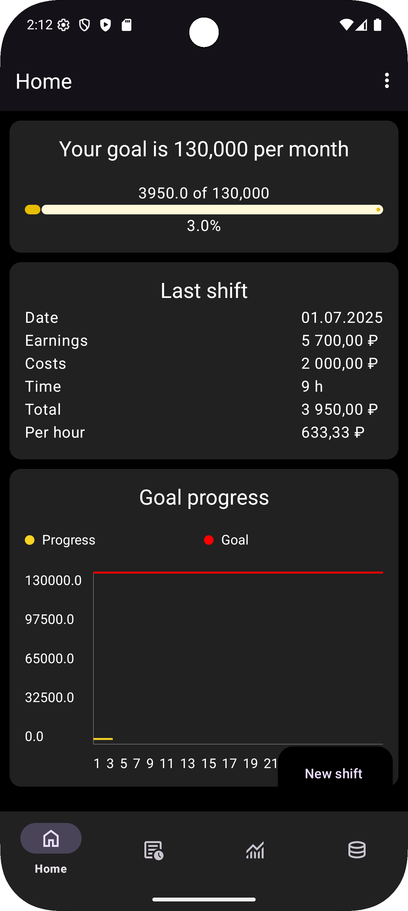
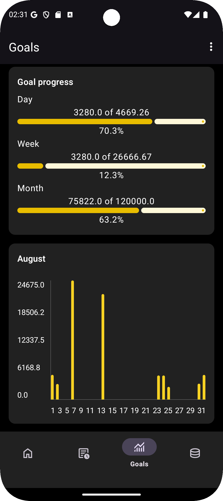
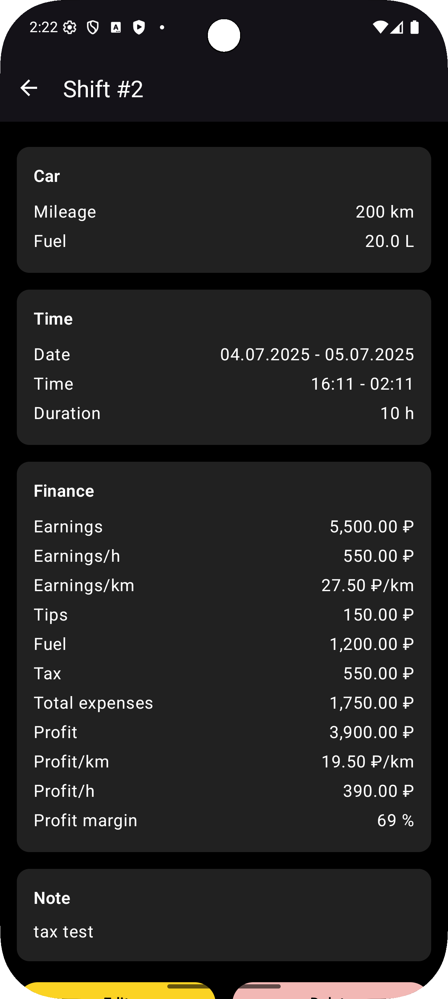
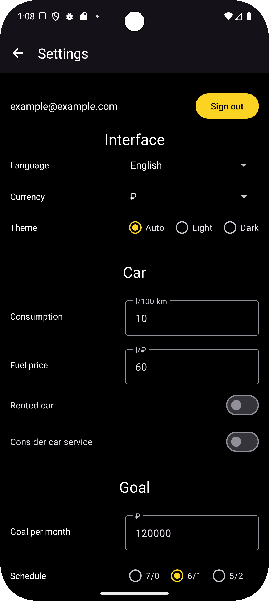

🚖 TaxiLog

TaxiLog is an app for taxi drivers that helps track shifts and analyze earnings.

## Screenshots

  
  
  
  

📌 Main Features:

✅ Shift log: track income, mileage, and working hours.

✅ Automatic statistics calculation by day, week, and month.

✅ Graphs and analytics for easy income tracking.

✅ Simple and intuitive record management.

📥 Installation

🔹 Via [Obtainium](
https://github.com/ImranR98/Obtainium)

If you have Obtainium installed, add this repository to it for automatic updates.

🔹 Alternative method

1. Go to the Releases section.
2. Download the latest APK version.
3. Install it on your device.

🚖 TaxiLog

TaxiLog – это приложение для водителей такси, которое помогает отслеживать смены и анализировать заработок.

📌 Основные возможности

✅ Ведение журнала смен: доход, пробег, время работы.

✅ Автоматический расчет статистики по дням, неделям и месяцам.

✅ Графики и аналитика для удобного просмотра динамики доходов.

✅ Удобное управление записями.

📥 Установка

🔹 Через [Obtainium](https://github.com/ImranR98/Obtainium):

Если у вас установлен Obtainium, добавьте в него этот репозиторий и обновляйтесь автоматически.

🔹 Альтернативный способ:

1. Перейдите в раздел Releases.
2. Скачайте последнюю версию APK.
3. Установите на своё устройство.
